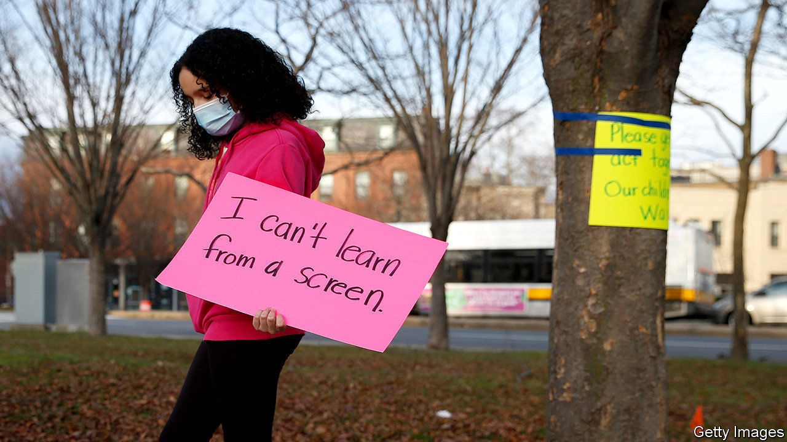

###### Lessons learned

# Shutting schools has hit poor American children’s learning 

##### Evidence is trickling in that this year’s cohort have fallen behind 

 

> Dec 19th 2020 


CLOSED SCHOOLS are bad for all children, but especially bad for poor and disadvantaged pupils. This basic pattern recurs wherever and whenever researchers look for it—in the wake of an epidemic of polio in America in 1916, after teachers’ strikes in Argentina since the 1980s, and after a devastating earthquake in Pakistani-controlled Kashmir in 2005.


Most natural experiments in school disruption come after isolated natural disasters. The covid-19 pandemic is leading to a simultaneous global experiment, however. In America, where schools have been significantly disrupted for the better part of a year, the first batches of reliable data are being gathered to assess how bad the damage has actually been. Sorting through them shows that sadly, America has not defied the gloomy predictions.


A recent analysis of standardised tests carried out by McKinsey, a consulting firm, found that pupils examined in the autumn had learned 33% less maths and 13% less reading than expected. For schools that are majority non-white, the learning losses were much steeper: pupils there had learned 41% less maths and 23% less reading. NWEA, a producer and administrator of standardised exams used in primary and secondary schools, published its own review of autumn scores that was less worrying. Pupils slid back substantially in maths, but not reading, with few detectable differences along racial or socioeconomic lines. But a substantial share of students, disproportionately poor and non-white, simply did not take the tests this year—which may have flattered the results.


In Washington, DC, 73% of white children in kindergarten and 45% of black children typically show adequate reading progress. When examined this year, white children showed a modest drop in adequate literacy, to 67%, while black children experienced a much larger one—to 31%. The gaps are also showing up in coursework, not just exams. Teachers in Los Angeles are reporting a stark increase in the number of failing grades—with the greatest increase in poor neighbourhoods. Researchers from Brown and Harvard universities examining data from Zearn, an online maths-teaching platform, found that pupils in high-income schools are actually performing 12% better in their coursework than in January 2020. But for low-income schools, scores fell by 17%.


The results suggest that the fears of worsening achievement gaps at the start of the pandemic were justified. There are enormous racial gaps in the kinds of instruction being received: 70% of black and Hispanic children are receiving fully remote education, compared with 50% of white pupils. Parents with the means to do so appear to be pulling their children out of public education altogether. There are 31,000 fewer pupils in the New York City public school system than in 2019; the roster in Austin, Texas, is 6% smaller. Instead, parents are hiring private tutors to teach their children in person. That is almost certain to widen the achievement gap.


Standardised exams are far from perfect. They do not measure the learning of impatient children well. More meaningful measures of lost learning, such as wages in adulthood, will not be known for years. Yet tests are not all bad. Given third-grade maths scores, researchers can quite accurately pick out which children will go on to become patent-holding inventors. They need not be a counsel of despair. Learning loss is remediable. But it requires the sort of serious investment that only Congress could provide and, so far, the gridlocked House and Senate have not seemed especially interested in providing it. ■


Editor’s note: Some of our covid-19 coverage is free for readers of The Economist Today, our daily . For more stories and our pandemic tracker, see our 

